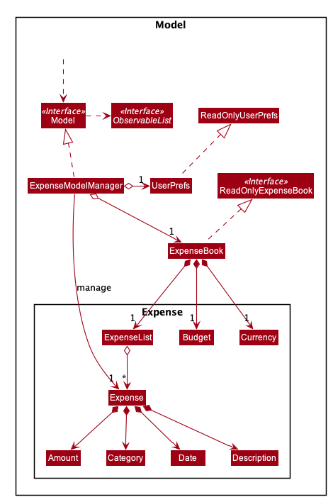
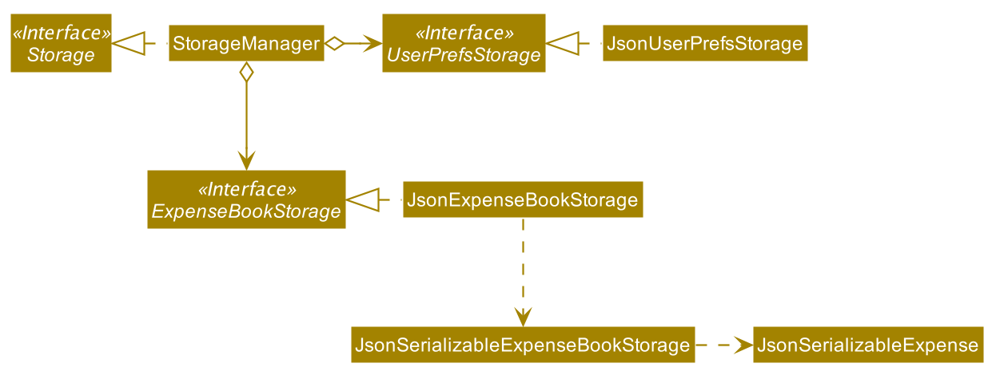
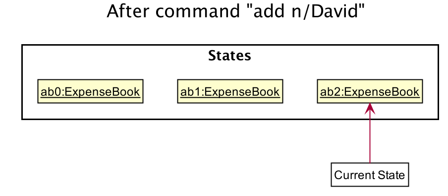
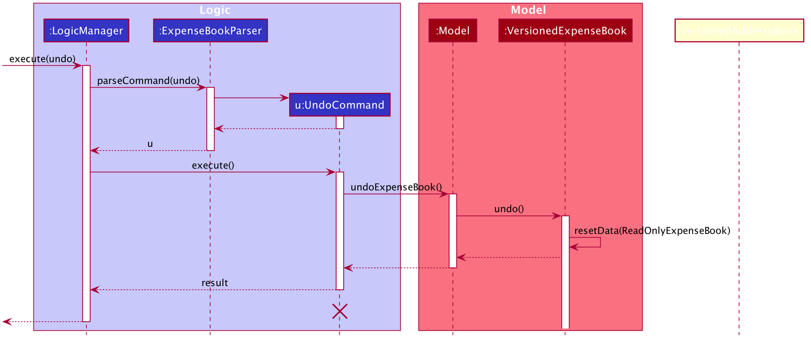
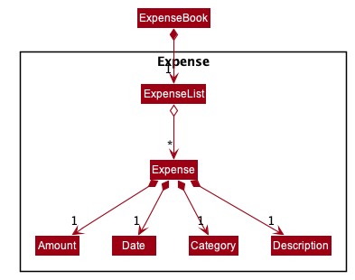
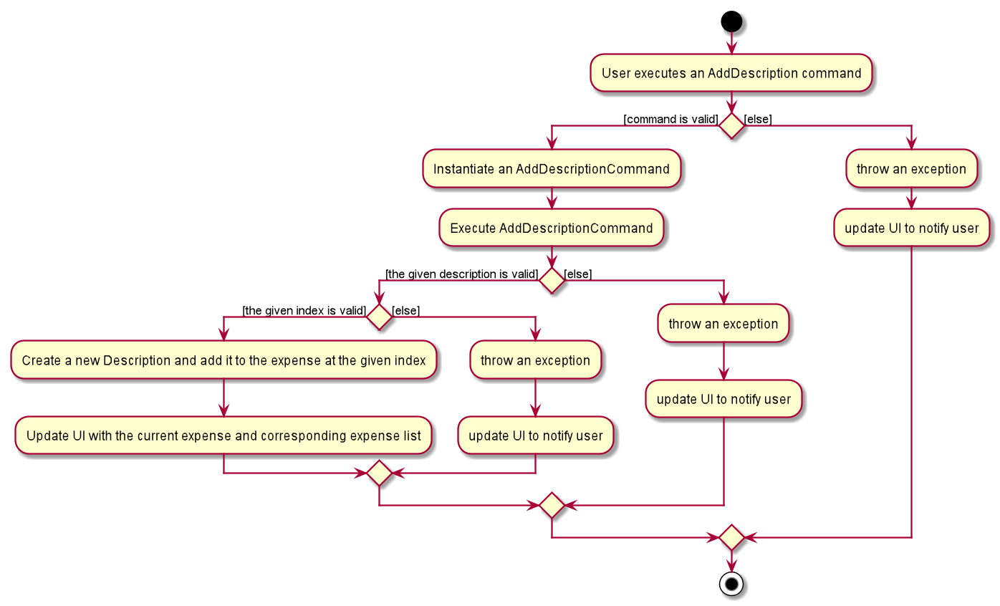

* Table of Contents
{:toc}

--------------------------------------------------------------------------------------------------------------------

## **Setting up, getting started**

Refer to the guide [_Setting up and getting started_](SettingUp.md).

--------------------------------------------------------------------------------------------------------------------

## **Design**

### Architecture

The ***Architecture Diagram*** given above explains the high-level design of the App. Given below is a quick overview of each component.

:bulb: **Tip:** The `.puml` files used to create diagrams in this document can be found in the [diagrams](https://github.com/se-edu/addressbook-level3/tree/master/docs/diagrams/) folder. Refer to the [_PlantUML Tutorial_ at se-edu/guides](https://se-education.org/guides/tutorials/plantUml.html) to learn how to create and edit diagrams.

**`Main`** has two classes called [`Main`](https://github.com/se-edu/addressbook-level3/tree/master/src/main/java/seedu/address/Main.java) and [`MainApp`](https://github.com/se-edu/addressbook-level3/tree/master/src/main/java/seedu/address/MainApp.java). It is responsible for,
* At app launch: Initializes the components in the correct sequence, and connects them up with each other.
* At shut down: Shuts down the components and invokes cleanup methods where necessary.

[**`Commons`**](#common-classes) represents a collection of classes used by multiple other components.

The rest of the App consists of four components.

* [**`UI`**](#ui-component): The UI of the App.
* [**`Logic`**](#logic-component): The command executor.
* [**`Model`**](#model-component): Holds the data of the App in memory.
* [**`Storage`**](#storage-component): Reads data from, and writes data to, the hard disk.

Each of the four components,

* defines its *API* in an `interface` with the same name as the Component.
* exposes its functionality using a concrete `{Component Name}Manager` class (which implements the corresponding API `interface` mentioned in the previous point.

For example, the `Logic` component (see the class diagram given below) defines its API in the `Logic.java` interface and exposes its functionality using the `LogicManager.java` class which implements the `Logic` interface.

**How the architecture components interact with each other**

The *Sequence Diagram* below shows how the components interact with each other for the scenario where the user issues the command `delete 1`.

The sections below give more details of each component.

### UI component

**API** :
[`Ui.java`](https://github.com/se-edu/addressbook-level3/tree/master/src/main/java/seedu/address/ui/Ui.java)

The UI consists of a `MainWindow` that is made up of parts e.g.`CommandBox`, `ResultDisplay`, `PersonListPanel`, `StatusBarFooter` etc. All these, including the `MainWindow`, inherit from the abstract `UiPart` class.

The `UI` component uses JavaFx UI framework. The layout of these UI parts are defined in matching `.fxml` files that are in the `src/main/resources/view` folder. For example, the layout of the [`MainWindow`](https://github.com/se-edu/addressbook-level3/tree/master/src/main/java/seedu/address/ui/MainWindow.java) is specified in [`MainWindow.fxml`](https://github.com/se-edu/addressbook-level3/tree/master/src/main/resources/view/MainWindow.fxml)

The `UI` component,

* Executes user commands using the `Logic` component.
* Listens for changes to `Model` data so that the UI can be updated with the modified data.

### Logic component

**API** :
[`Logic.java`](https://github.com/se-edu/addressbook-level3/tree/master/src/main/java/seedu/address/logic/Logic.java)

1. `Logic` uses the `AddressBookParser` class to parse the user command.
1. This results in a `Command` object which is executed by the `LogicManager`.
1. The command execution can affect the `Model` (e.g. adding a person).
1. The result of the command execution is encapsulated as a `CommandResult` object which is passed back to the `Ui`.
1. In addition, the `CommandResult` object can also instruct the `Ui` to perform certain actions, such as displaying help to the user.

Given below is the Sequence Diagram for interactions within the `Logic` component for the `execute("delete 1")` API call.

:information_source: **Note:** The lifeline for `DeleteCommandParser` should end at the destroy marker (X) but due to a limitation of PlantUML, the lifeline reaches the end of diagram.

### Model component

**API** : [`Model.java`](https://github.com/se-edu/addressbook-level3/tree/master/src/main/java/seedu/address/model/Model.java)

The `Model`,

* stores a `UserPref` object that represents the user’s preferences.
* stores the address book data.
* exposes an unmodifiable `ObservableList<Person>` that can be 'observed' e.g. the UI can be bound to this list so that the UI automatically updates when the data in the list change.
* does not depend on any of the other three components.

:information_source: **Note:** An alternative (arguably, a more OOP) model is given below. It has a `Tag` list in the `AddressBook`, which `Person` references. This allows `AddressBook` to only require one `Tag` object per unique `Tag`, instead of each `Person` needing their own `Tag` object. 

### Storage component

**API** : [`Storage.java`](https://github.com/AY2021S1-CS2103T-W10-1/tp/blob/master/src/main/java/seedu/address/storage/Storage.java)

The `Storage` component,
* can save `UserPref` objects in json format and read it back.
* can save the expense book data in json format and read it back.

### Common classes

Classes used by multiple components are in the `seedu.addressbook.commons` package.

--------------------------------------------------------------------------------------------------------------------

## **Implementation**

This section describes some noteworthy details on how certain features are implemented.

### \[Proposed\] Delete Expense feature

#### Proposed Implementation

The proposed delete mechanism is facilitated by `VersionedExpenseBook`. It extends `ExpenseBook` and stored internally as an `ExpenseBookStateList` and `currentStatePointer`. Additionally, it implements the following operations:

* `VersionedAddressBook#save()` — Saves the current expense book state in its history.
* `VersionedAddressBook#delete()` — Restores the previous expense book state from its history.

These operations are exposed in the `Model` interface as `Model#saveExpenseBook()`, `Model#deleteExpenseBook()` respectively.

Given below is an example usage scenario and how the delete mechanism behaves at each step.

Step 1. The user launches the application for the first time. The `VersionedExpenseBook` will be initialized with the initial address book state, and the `currentStatePointer` pointing to that single expense book state.

Step 2. The user executes `delete 5` command to delete the 5th expenses in the expense book. The `delete` command calls `Model#saveExpenseBook()`, causing the modified state of the expense book after the `delete 5` command executes to be saved in the `expenseBookStateList`, and the `currentStatePointer` is shifted to the newly inserted expense book state.

Step 3. The user executes `add a/100 c/Entertainment D/1 d/Movie` to add a new expense. The `add` command also calls `Model#saveAddressBook()`, causing another modified expense book state to be saved into the `expenseBookStateList`.

:information_source: **Note:** If a command fails its execution, it will not call `Model#saveExpenseBook()`, so the expense book state will not be saved into the `expenseBookStateList`.

Step 4. The user now decides that adding the expense was a mistake, and decides to delete that expense by executing the `delete` command. The `delete` command will call `Model#deleteExpenseBook()`, which will shift the `currentStatePointer` once to the left, pointing it to the previous expense book state, and restores the expense book to that state.

:information_source: **Note:** If the `currentStatePointer` is at index 0, pointing to the initial ExpenseBook state, then there are no previous ExpenseBook states to restore. The `delete` command uses `Model#canDeleteExpenseBook()` to check if this is the case. If so, it will return an error to the user rather
than attempting to perform the undo.

The following sequence diagram shows how the delete operation works:

:information_source: **Note:** The lifeline for `DeleteExpenseCommand` should end at the destroy marker (X) but due to a limitation of PlantUML, the lifeline reaches the end of diagram.

The `redo` command does the opposite — it calls `Model#redoAddressBook()`, which shifts the `currentStatePointer` once to the right, pointing to the previously undone state, and restores the address book to that state.

:information_source: **Note:** If the `currentStatePointer` is at index `addressBookStateList.size() - 1`, pointing to the latest address book state, then there are no undone AddressBook states to restore. The `redo` command uses `Model#canRedoAddressBook()` to check if this is the case. If so, it will return an error to the user rather than attempting to perform the redo.

Step 5. The user then decides to execute the command `list`. Commands that do not modify the address book, such as `list`, will usually not call `Model#commitAddressBook()`, `Model#undoAddressBook()` or `Model#redoAddressBook()`. Thus, the `addressBookStateList` remains unchanged.

Step 6. The user executes `clear`, which calls `Model#commitAddressBook()`. Since the `currentStatePointer` is not pointing at the end of the `addressBookStateList`, all address book states after the `currentStatePointer` will be purged. Reason: It no longer makes sense to redo the `add n/David …​` command. This is the behavior that most modern desktop applications follow.

The following activity diagram summarizes what happens when a user executes a new command:

#### Design consideration:

##### Aspect: How undo & redo executes

* **Alternative 1 (current choice):** Saves the entire address book.
  * Pros: Easy to implement.
  * Cons: May have performance issues in terms of memory usage.

* **Alternative 2:** Individual command knows how to undo/redo by
  itself.
  * Pros: Will use less memory (e.g. for `delete`, just save the person being deleted).
  * Cons: We must ensure that the implementation of each individual command are correct.

_{more aspects and alternatives to be added}_

### \[Proposed\] Data archiving

_{Explain here how the data archiving feature will be implemented}_

### \[Proposed\] Undo/redo feature

#### Proposed Implementation

The proposed undo/redo mechanism is facilitated by `VersionedAddressBook`. It extends `AddressBook` with an undo/redo history, stored internally as an `addressBookStateList` and `currentStatePointer`. Additionally, it implements the following operations:

* `VersionedAddressBook#commit()` — Saves the current address book state in its history.
* `VersionedAddressBook#undo()` — Restores the previous address book state from its history.
* `VersionedAddressBook#redo()` — Restores a previously undone address book state from its history.

These operations are exposed in the `Model` interface as `Model#commitAddressBook()`, `Model#undoAddressBook()` and `Model#redoAddressBook()` respectively.

Given below is an example usage scenario and how the undo/redo mechanism behaves at each step.

Step 1. The user launches the application for the first time. The `VersionedAddressBook` will be initialized with the initial address book state, and the `currentStatePointer` pointing to that single address book state.

Step 2. The user executes `delete 5` command to delete the 5th person in the address book. The `delete` command calls `Model#commitAddressBook()`, causing the modified state of the address book after the `delete 5` command executes to be saved in the `addressBookStateList`, and the `currentStatePointer` is shifted to the newly inserted address book state.

Step 3. The user executes `add n/David …​` to add a new person. The `add` command also calls `Model#commitAddressBook()`, causing another modified address book state to be saved into the `addressBookStateList`.

:information_source: **Note:** If a command fails its execution, it will not call `Model#commitAddressBook()`, so the address book state will not be saved into the `addressBookStateList`.

Step 4. The user now decides that adding the person was a mistake, and decides to undo that action by executing the `undo` command. The `undo` command will call `Model#undoAddressBook()`, which will shift the `currentStatePointer` once to the left, pointing it to the previous address book state, and restores the address book to that state.

:information_source: **Note:** If the `currentStatePointer` is at index 0, pointing to the initial AddressBook state, then there are no previous AddressBook states to restore. The `undo` command uses `Model#canUndoAddressBook()` to check if this is the case. If so, it will return an error to the user rather
than attempting to perform the undo.

The following sequence diagram shows how the undo operation works:

:information_source: **Note:** The lifeline for `UndoCommand` should end at the destroy marker (X) but due to a limitation of PlantUML, the lifeline reaches the end of diagram.

The `redo` command does the opposite — it calls `Model#redoAddressBook()`, which shifts the `currentStatePointer` once to the right, pointing to the previously undone state, and restores the address book to that state.

:information_source: **Note:** If the `currentStatePointer` is at index `addressBookStateList.size() - 1`, pointing to the latest address book state, then there are no undone AddressBook states to restore. The `redo` command uses `Model#canRedoAddressBook()` to check if this is the case. If so, it will return an error to the user rather than attempting to perform the redo.

Step 5. The user then decides to execute the command `list`. Commands that do not modify the address book, such as `list`, will usually not call `Model#commitAddressBook()`, `Model#undoAddressBook()` or `Model#redoAddressBook()`. Thus, the `addressBookStateList` remains unchanged.

Step 6. The user executes `clear`, which calls `Model#commitAddressBook()`. Since the `currentStatePointer` is not pointing at the end of the `addressBookStateList`, all address book states after the `currentStatePointer` will be purged. Reason: It no longer makes sense to redo the `add n/David …​` command. This is the behavior that most modern desktop applications follow.

The following activity diagram summarizes what happens when a user executes a new command:

#### Design consideration:

##### Aspect: How undo & redo executes

* **Alternative 1 (current choice):** Saves the entire address book.
  * Pros: Easy to implement.
  * Cons: May have performance issues in terms of memory usage.

* **Alternative 2:** Individual command knows how to undo/redo by
  itself.
  * Pros: Will use less memory (e.g. for `delete`, just save the person being deleted).
  * Cons: We must ensure that the implementation of each individual command are correct.

_{more aspects and alternatives to be added}_

### \[Proposed\] Data archiving

_{Explain here how the data archiving feature will be implemented}_

### Manage description of Expense Feature

As an expense management application, one of the most important features is to add a description when
 recording down and tracking the expenses, so that later when users review their expenses, they have a better
 idea of what he spent on. 

This section will cover the details of the current implementation and design considerations of
the description management feature.

#### Current Implementation

The expense management feature supports five main operations:

* `add` - record an expense, with an amount, a date, a category and a description as fields.
* `view` - view the details of an existing expense.
* `delete` - delete an existing expense from the expense list.
* `addDes` - add a description to an existing expense.
* `deleteDes` - delete the description of an existing expense.

The add description features and delete description feature are mainly supported by the `Expense` class.

Given below is the class diagram of the `Expense` class.

Fig. Class Diagram for Expense.

Given below is an example usage scenario and how the mechanism for adding description to expenses behaves at each step.

The following activity diagram summarizes what happens when a user executes the `AddDescriptionCommand`:

Fig. Activity Diagram for the Execution of `AddTaskCommand`

Step 1. The user launches the application.

Step 2. Unisave displays a list of existing expenses in the UI.

Step 3. The user executes `Spent on books` to add the description 
"Spent on books" to the expense with index 2 in the displayed expense list.
The `AddDescriptionCommand` calls `Description` to create a new description object and a new Expense object containing 
this newly created description object, and replace the previous expense object with this updated expense in the 
`ExpenseList` stored in `UniSave`.

The sequence diagram below shows the high-level abstraction of how Unisave processes user request
to execute `addDes 2 d/Spent on books`:

High Level Sequence Diagram for the Execution of `addDes 2 d/Spent on books`

#### Design Considerations

##### Aspect: How to manage empty description, as description is optional.

* Alternative 1 (current choice): Use empty string to create description, if description is empty.
** Pros: Expense always contains a description object. No possibility of 0 description object in expense.
** Cons: When deleting the description, the description object is not deleted and "Description:" field is still shown on UI.
* Alternative 2: Use an `Optional` for descriptions.
** Pros: More intuitive.
** Cons: Harder to manage and prone to error.

--------------------------------------------------------------------------------------------------------------------

## **Documentation, logging, testing, configuration, dev-ops**

* [Documentation guide](Documentation.md)
* [Testing guide](Testing.md)
* [Logging guide](Logging.md)
* [Configuration guide](Configuration.md)
* [DevOps guide](DevOps.md)

--------------------------------------------------------------------------------------------------------------------

## **Appendix: Requirements**

### Product scope

**Target user profile**:

* university international students who want to plan their finance
* prefer desktop apps over other types
* can type fast
* prefers typing to mouse interactions
* is reasonably comfortable using CLI apps
* spend various currency

**Value proposition**:

1. Problem: spending in different currency not tracked by many existing apps -> track spending in different currency
2. Problem: student exceeds budget, spending without control -> help you manage expense reasonably, save some money at the end of the month
3. Problem: student want to plan their finance, but writing them down is too troublesome -> this app is very convenient to use as users can record their finance any time they want
4. Problem: Student spend at various fields, too messy to record -> the labels functions allow students to organize their spending
5. Problem: Existing apps are complicated, not easy to use -> this app is simple to use and very user-friendly.

### User stories

Priorities: High (must have) - `* * *`, Medium (nice to have) - `* *`, Low (unlikely to have) - `*`

| Priority | As a …​                                    | I want to …​                     | So that I can…​                                                                  |
| -------- | ------------------------------------------ | ---------------------------------- | --------------------------------------------------------------------------------------- |
| `* * *`  | user                                       | Add an expense with category       | keep track of my accounts                                                               |
| `* * *`  | user                                       | View an expense                    | easily see the details such as dates, amount and descriptions of a specific expense     |
| `* * *`  | user                                       | Delete an expense                  | delete the expense when I added wrongly                                                 |
| `* * *`  | user                                       | List all expenses                  | view all expenses                                                                       |
| `* * *`  | user                                       | Tag an expense                     | view the specific task I spend on                                                       |
| `* * *`  | user                                       | Set budget                         | plan my expenses                                                                        |
| `* * *`  | user                                       | View budget                        | view how much i can spend before exceeding the monthly limit                            |
| `* * *`  | user                                       | Delete a tag of an expense         | delete the category label when I tagged wrongly                                         |
| `* *`    | user                                       | List all categories                | view all expenses                                                                       |
| `* *`    | user                                       | List all expenses in one category  | view all expenses spent under one category                                              |

*{More to be added}*

### Use cases

(For all use cases below, the **System** is the `AddressBook` and the **Actor** is the `user`, unless specified otherwise)

**Use case: Add expense with its category**

**MSS**

1.  User requests to list expenses
2.  UniSave shows a list of existing expenses
3.  User requests to add a category to a specific expense in the list
4.  UniSave adds the category input by user to the specific expense

    Use case ends.

**Extensions**

* 2a. The list is empty.

  Use case ends.

* 3a. The given index is invalid.

    * 3a1. UniSave shows an error message.

    Use case resume at Step 2

**Use case: View expense**

**MSS**

1.  User requests to list all the expenses
2.  UniSave shows a list of existing expenses

    Use case ends.

**Use case: Delete a current expense**

**MSS**

1.  User requests to list expenses
2.  UniSave shows a list of existing expenses
3.  User requests to delete a specific expenses in the list
4.  UniSave deletes the requested expense chosen by the user.

    Use case ends.

**Extensions**

* 2a. The list is empty.

  Use case ends.

* 3a. The given index is invalid.

    * 3a1. UniSave shows an error message.

      Use case resumes at step 2.

**Use case: Add a description to an expense**

**MSS**

1.  User requests to list expenses
2.  UniSave shows a list of expenses
3.  User requests to add a description to a specific expense in the list
4.  UniSave adds the description input by user to the specific expense

**Use case: Delete the current description of an expense**

**MSS**

1.  User requests to list expenses
2.  UniSave shows a list of expenses
3.  User requests to delete the description of a specific expense in the list
4.  UniSave deletes the description of expense chosen by the user.

    Use case ends.

**Extensions**

* 2a. The list is empty.

  Use case ends.

* 3a. The given index is invalid.

    * 3a1. UniSave shows an error message.

      Use case resumes at step 2.

**Extensions**

* 2a. The input category is invalid or does not exist.

    * 2a1. UniSave shows an error message.

      Use case resumes at step 2.

**Use case: List all expenses**

**MSS**

1.  User requests to list all the expenses
2.  AddressBook shows a list of expenses

    Use case ends.

**Use case: View category labels**

**MSS**

1.  User requests to list available category labels
2.  UniSave shows a list of existing category labels

    Use case ends.

**Use case: List all expenses in a specific category**

**MSS**
1.  User requests to list all the expenses in a specific category
2.  AddressBook shows a list of expenses in that category

**Use case: Set Budget**

**MSS**

1.  User requests to set a new budget.
2.  UniSave updates and displays the new budget.

    Use case ends.

**Extensions**

* 1a. UniSave detects an error in the entered value.
    * 1a1. UniSave requests for the correct value.
    * 1a2. User enters a valid value.
    * 1a3. UniSave updates and displays the new budget.
    * Use case ends.

**Use case: View Total Budget**

**MSS**

1.  User requests to view total budget.
2.  UniSave displays the total budget.

    Use case ends.

**Extensions**

* 2a. User does not have a budget set yet.
    * 2a1. Unisave displays the default budget 0.
    * 2a2. UniSave requests for setting a budget.
    * 2a3. User sets a budget.
    * 2a4. UniSave displays the amount set by the user.
    * Use case ends.

**Use case: View Remaining Budget**

**MSS**

1.  User requests to view remaining budget.
2.  UniSave displays the remaining budget.

    Use case ends.

**Use case: Alert**

**MSS**

1.  User's spending exceed budget.
2.  UniSave shows alerts.

    Use case ends.

### Non-Functional Requirements

1. Should be able to function well without connecting to internet.
2. Should be accessed for a single user.
3. A user with above average typing speed for regular English text (i.e. not code, not system admin commands) should be able to accomplish most of the tasks faster using commands than using a mouse.
4. The product should be easy to use by a novice with no experience of using a finance tracking application.
5. Documentation should be easy to read and understand with proper highlighting.

### Glossary

* **Mainstream OS**: Windows, Linux, Unix, OS-X
* **Expense**: The amount of money spent by the user student in a certain event
* **Budget**: The maximum amount of money that the user student can spend

--------------------------------------------------------------------------------------------------------------------

## **Appendix: Instructions for manual testing**

Given below are instructions to test the app manually.

:information_source: **Note:** These instructions only provide a starting point for testers to work on;
testers are expected to do more *exploratory* testing.

### Launch and shutdown

1. Initial launch

   1. Download the jar file and copy into an empty folder

   1. Double-click the jar file Expected: Shows the GUI with a set of sample contacts. The window size may not be optimum.

1. Saving window preferences

   1. Resize the window to an optimum size. Move the window to a different location. Close the window.

   1. Re-launch the app by double-clicking the jar file. 
       Expected: The most recent window size and location is retained.

1. _{ more test cases …​ }_

### Deleting a person

1. Deleting an expense while all persons are being shown

   1. Prerequisites: List all expenses using the `list` command. Multiple expenses in the list.

   1. Test case: `delete 1` 
      Expected: First expense is deleted from the list. Details of the deleted expense shown in the status message. Timestamp in the status bar is updated.

   1. Test case: `delete 0` 
      Expected: No expense is deleted. Error details shown in the status message. Status bar remains the same.

   1. Other incorrect delete commands to try: `delete`, `delete x`, `...` (where x is larger than the list size) 
      Expected: Similar to previous.

1. _{ more test cases …​ }_

### Saving data

1. Dealing with missing/corrupted data files

   1. _{explain how to simulate a missing/corrupted file, and the expected behavior}_

1. _{ more test cases …​ }_
