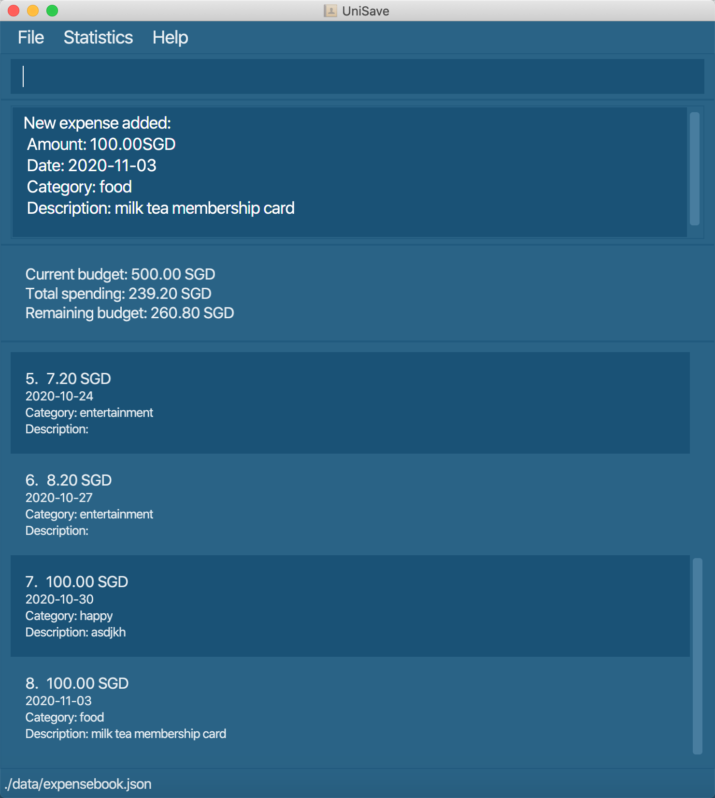
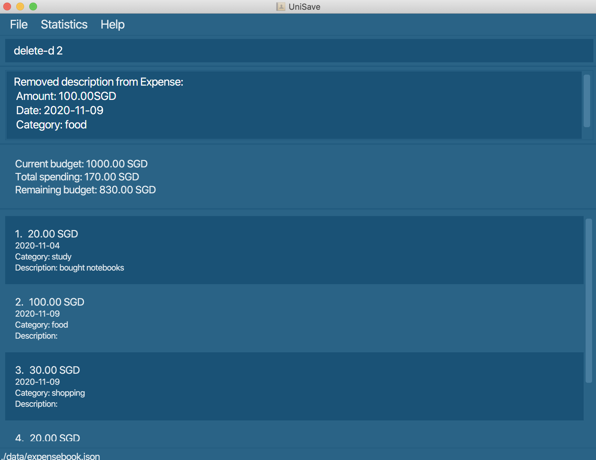
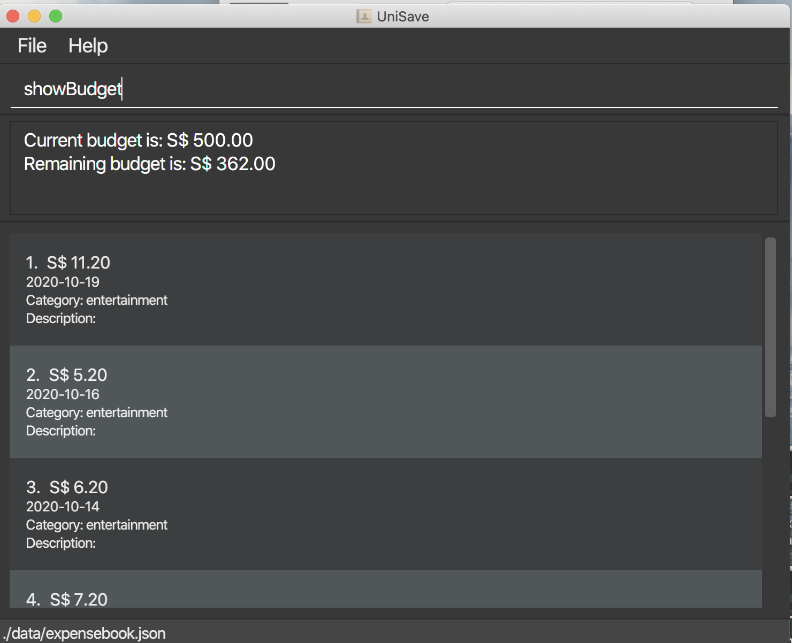
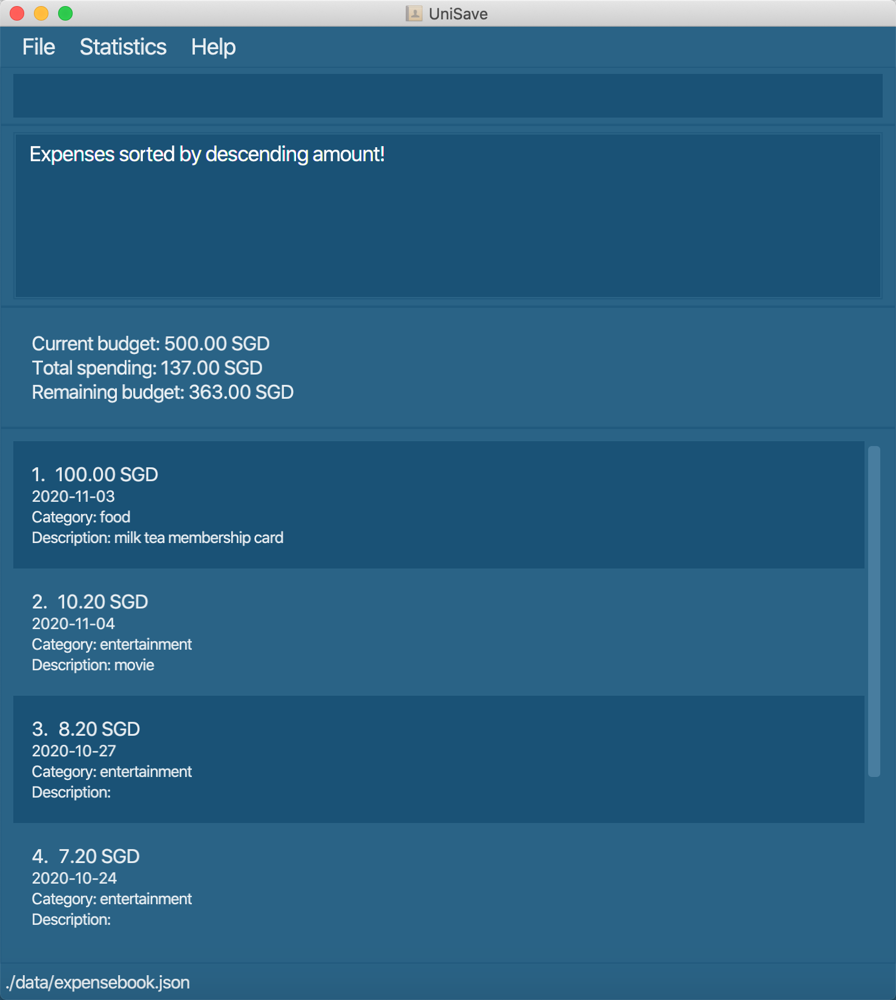

UniSave is a **desktop app for managing expenses, optimized for use via a Command Line Interface** (CLI) while still having the benefits of a Graphical User Interface (GUI).
If you can type fast, UniSave can get your financial management tasks done faster than traditional GUI apps.
Choose a section from the table of contents below and start using UniSave.

* Table of Contents
    * [1. Overview](#1-overview)
    * [2. Quick start](#2-quick-start)
    * [3. Features](#3-features)
        * [3.1 Adding an expense: `add`](#31-adding-an-expense-add)
        * [3.2 Listing all expenses : `list`](#32-listing-all-expenses--list)
        * [3.3 Listing all expenses in a category : `listbycategory`](#33-listing-all-expenses-in-a-category--listbycategory)
        * [3.4 Listing all expenses by date : `listbydate`](#34-listing-all-expenses-by-date--listbydate)
        * [3.5 Listing all expenses by description : `listbydesc`](#35-listing-all-expenses-by-description--listbydesc)
        * [3.6 Deleting an expense: `delete`](#36-deleting-an-expense-delete)
        * [3.7 View an expense : `view`](#37-view-an-expense--view)
        * [3.8 View Category Labels : `viewCategory`](#38-view-category-labels--viewcategory)
        * [3.9 Add a description to an expense : `addDes`](#39-add-a-description-to-an-expense--adddes)
        * [3.10 Delete description of an expense: `deleteDes`](#310-delete-description-of-an-expense-deletedes)
        * [3.11 Set Budget : `setBudget`](#311-set-budget--setbudget)
        * [3.12 Show budget : `showBudget`](#312-show-budget--showbudget)
        * [3.13 Exchange Currency : `exchange`](#313-exchange-currency--exchange)
        * [3.14 Clear data in UniSave : `clear`](#314-clear-data-in-unisave--clear)
        * [3.15 Exiting the program : `exit`](#315-exiting-the-program--exit)
        * [3.16 Saving the data](#316-saving-the-data)
        * [3.17 Show the statistic of the expenses: `showStatistic`](#317-show-the-statistic-of-the-expenses-showstatistic)
        * [3.18 Sort expenses by the amount of each expense: `sortByAmount`](#318-sort-existing-expenses-by-the-amount-of-expense-sortbyamount)
        * [3.19 Sort expenses by the date of each expense: `sortByTime`](#319-sort-existing-expenses-by-the-date-of-expense-sortbytime)
        * [3.20 Use Help Command to help you find all the commands: `help`](#320-use-help-command-to-help-you-find-all-the-commands-help)
    * [4. FAQ(Frequently Asked Question)](#4-faqfrequently-asked-question)
    * [5. Glossary](#5-glossary)
    * [6. Command Summary](#6-command-summary)

--------------------------------------------------------------------------------------------------------------------
## 1. Overview
UniSave is your desktop finance manager. It is an application that helps you manage your finance by tracking your spending, setting budget for each month, as well as viewing your expenses in various categories. Moreover, UniSave allows tracking expenses in different currencies.

UniSave targets international students in university who tend to incur a large amount of spending, including tuition fees, housing fees, transport and so on. University students are also more familiar with desktop applications and typing.
UniSave is available for the Linux, Windows and Mac OS operating systems.

## 2. Quick start

1. Ensure you have Java `11` or above installed in your Computer.

1. Download the latest `UniSave.jar` from [here](https://github.com/AY2021S1-CS2103T-W10-1/tp/releases).

1. Copy the file to the folder you want to use as the _home folder_ for your UniSave.

1. Double-click the file to start the app. In a few seconds, you should see a GUI similar to the diagram below. Note how the app contains some sample data. 
   

1. Type the command in the command box and press Enter to execute it. If you are not sure what are the command available,
you can type **`help`** You will be able to see a guide to briefly show you how to use the various commands

   Some example commands you can try:

   * **`list`** : Lists all expenses.

   * **`add`**`add a/50 c/ENTERTAINMENT D/1 d/yayymovie!` : Adds an expense 50$ categorised as `ENTERTAINMENT` that you spent yesterday with `yayymovie!` description.

   * **`delete`**`1` : Deletes the first expense shown in the expense list.

   * **`exit`** : Exits the app.

1. Refer to the [Features](#3-features) below for details of each command.

--------------------------------------------------------------------------------------------------------------------

## 3. Features

 * [3.1 Adding an expense: `add`](#31-adding-an-expense-add)
 * [3.2 Listing all expenses : `list`](#32-listing-all-expenses--list)
 * [3.3 Listing all expenses in a category : `listbycategory`](#33-listing-all-expenses-in-a-category--listbycategory)
 * [3.4 Listing all expenses by date : `listbydate`](#34-listing-all-expenses-by-date--listbydate)
 * [3.5 Listing all expenses by description : `listbydesc`](#35-listing-all-expenses-by-description--listbydesc)
 * [3.6 Deleting an expense: `delete`](#36-deleting-an-expense-delete)
 * [3.7 View an expense : `view`](#37-view-an-expense--view)
 * [3.8 View Category Labels : `viewCategory`](#38-view-category-labels--viewcategory)
 * [3.9 Add a description to an expense : `addDes`](#39-add-a-description-to-an-expense--adddes)
 * [3.10 Delete description of an expense: `deleteDes`](#310-delete-description-of-an-expense-deletedes)
 * [3.11 Set Budget : `setBudget`](#311-set-budget--setbudget)
 * [3.12 Show budget : `showBudget`](#312-show-budget--showbudget)
 * [3.13 Exchange Currency : `exchange`](#313-exchange-currency--exchange)
 * [3.14 Clear data in UniSave : `clear`](#314-clear-data-in-unisave--clear)
 * [3.15 Exiting the program : `exit`](#315-exiting-the-program--exit)
 * [3.16 Saving the data](#316-saving-the-data)
 * [3.17 Show the statistic of the expenses: `showStatistic`](#317-show-the-statistic-of-the-expenses-showstatistic)
 * [3.18 Sort expenses by the amount of each expense: `sortByAmount`](#318-sort-existing-expenses-by-the-amount-of-expense-sortbyamount)
 * [3.19 Sort expenses by the date of each expense: `sortByTime`](#319-sort-existing-expenses-by-the-date-of-expense-sortbytime)
 * [3.20 Use Help Command to help you find all the commands: `help`](#320-use-help-command-to-help-you-find-all-the-commands-help)

**:information_source: Notes about the command format:** 

* Words in `UPPER_CASE` are the parameters to be supplied by the user. 
  e.g. in `add a/AMOUNT`, `AMOUNT` is a parameter which can be used as `add a/100`.

### Commands  

#### 3.1 Adding an expense: `add`

Adds an expense, including fields amount, category, date, description, to your expense book. You must specify all fields when adding the expense.

Format: `add a/AMOUNT c/CATEGORY D/DATE d/DESCRIPTION`

:bulb: **Tip:**
A date can be given in one of these two forms:
i) A date is given as a single integer, corresponding to how many days ago.E.g: 1 means you made the expenses one day ago.
ii) A date is given as the exact date in YYYY-MM-DD format.E.g: 2020-10-28 

:bulb: **Tip:**
The sample categories are FOODBEVERAGE, SHOPPING, ENTERTAINMENT. Category can be added manually.

:bulb: **Tip:**
The description must not begin with a blank space. E.g: Putting "d/ " and "d/ xx" for the description field would result in invalid format.

:bulb: **Tip:**
You may enter each field in a different order. That means `add a/100 c/FOODBEVERAGE D/1 d/milk tea membership card` gives the 
same result as `add D/1 d/milk tea membership card c/FOODBEVERAGE a/100`.

Examples:
* `add a/100 c/FOODBEVERAGE D/1 d/milk tea membership card`
* `add a/50 c/ENTERTAINMENT D/2020-09-28 d/yayymovie!`

Navigate back to the feature list: [Features](#3-features)

#### 3.2 Listing all expenses : `list`

You can list out all the expenses stored in UniSave.

Format: `list`

Examples:
* `list`: list all the expenses in all the categories.

Navigate back to the feature list: [Features](#3-features)

#### 3.3 Listing all expenses in a category : `listbycategory`

You can specify a category and then list all the expenses that belong to that category.

Format: `listbycategory CATEGORY`

Examples:
* `listbycategory entertainment`: list all the expenses in entertainment.

Navigate back to the feature list: [Features](#3-features)

#### 3.4 Listing all expenses by date : `listbydate`

You can find all the expenses that are saved on a specific date and list them out.

Format: `listbydate YYYY-MM-DD`

:bulb: **Tip:**
The date format `YYYY-MM-DD` is sensitive and only this format is recognisable for this command.

:bulb: **Tip:**
Multiple date input is allowed.

Examples:
* `listbydate 2020-05-22`: list all the expenses that are saved on 2020-05-22.

Navigate back to the feature list: [Features](#3-features)

#### 3.5 Listing all expenses by description : `listbydesc`

You can search for keywords in description and list all the expenses which description matches the keywords.

Format: `listbydesc DESCRIPTION`

:bulb: **Tip:**
Multiple description input is allowed.

Examples:
* `listbydesc movies`: list all the expenses which description has the keyword 'movies'.

Navigate back to the feature list: [Features](#3-features)

#### 3.6 Deleting an expense: `delete`

Deletes the specified expense from the expense list.

Format: `delete INDEX`

* Deletes the expense at the specified `INDEX`.
* The index refers to the index number shown in the expense list.
* The index **must be a positive integer** 1, 2, 3, …​

Examples:
* `list` followed by `delete 2` deletes the 2nd expense in the expense list.

Navigate back to the feature list: [Features](#3-features)

#### 3.7 View an expense : `view`

View an expense in the expense list.

Format: `view INDEX`

View the expense at the specified INDEX.

The index refers to the index number shown in the displayed expense list.

* The index must be a **positive integer** 1, 2, 3, …​

Examples:
* `view 3` views the `amount, category, date and description` of the third expense displayed in the list.

Navigate back to the feature list: [Features](#3-features)

#### 3.8 View Category Labels : `viewCategory`

Show all the category lables used in the UniSave.

Format: `viewCategory`

#### 3.9 Add a description to an expense : `addDes`

Add a description to an existing expense in the finance book.

:bulb: **Tip:**
The newly added description will override the existing description of the specified expense.

:bulb: **Tip:**
If you use `addDes INDEX` or `addDes INDEX d/` without specifying the description field, the existing description will be removed.

Format: `addDes INDEX d/DESCRIPTION`

* Add description field to the expense at the specified `INDEX`. The `INDEX` refers to the index number shown in the displayed expense list. The index **must be a positive integer** 1, 2, 3, …​
* Existing description will be overwrote to the new description.

Examples:
`addDes 3 d/movies` Add the description field `movies` to the 3rd expense.

Navigate back to the feature list: [Features](#3-features)

#### 3.10 Delete description of an expense: `deleteDes`

Delete the description field of an existing expense.

Format: `deleteDes INDEX`

:bulb: **Tip:**
The description field of the specified expense will still exist, just that it will be empty.

* Deletes the description of the expense at the specified INDEX.
* The `INDEX` refers to the index number shown in the expense list.
* The `INDEX` **must be a positive integer** 1, 2, 3, …​

Examples:
`deleteDes 6` Deletes the description field of the 1st expense.

Navigate back to the feature list: [Features](#3-features)

#### 3.11 Set Budget : `setBudget`

Set the budget for UniSave. Default budget is 0 SGD.

Format: `setBudget AMOUNT`

Example:
`setBudget 500.0`: Set the budget to 500.

Navigate back to the feature list: [Features](#3-features)

#### 3.12 Show budget : `showBudget`

Show the budget last set and the remaining budget in the UniSave.

Format: `showBudget`

Navigate back to the feature list: [Features](#3-features)

#### 3.13 Exchange Currency : `exchange`

Convert the currency of UniSave from current currency to the input currency, along with the exchange rate.

Format: `exchange s/CURRENCY_CODE`

Example: `exchange s/CNY`

Before Exchange: 

After Exchange: 

Navigate back to the feature list: [Features](#3-features)

#### 3.14 Clear data in UniSave : `clear`

Clears the data in the program.

Format: `clear`

Navigate back to the feature list: [Features](#3-features)

#### 3.15 Exiting the program : `exit`

Exits the program.

Format: `exit`

Navigate back to the feature list: [Features](#3-features)

#### 3.16 Saving the data

UniSave data are saved in the hard disk automatically after any command that changes the data. There is no need to save manually.

Navigate back to the feature list: [Features](#3-features)

#### 3.17 Show the statistic of the expenses: `showStatistic`

Show the overview of the expenses, such as the total number of expenses as welll as the total spending.

There are arranging in descending order in which the category that you spent the most will on the first row.

Format: `showStatistic`

Examples: `showStatistic`

Navigate back to the feature list: [Features](#3-features)

#### 3.18 Sort existing expenses by the amount of expense: `sortByAmount`

Show all existing expenses which sre sorted by amount of expense in either descending or ascending order.
Format: `sortByAmount descending`
        `sortByAmount ascending`

Examples: `sortByAmount ascending`

Navigate back to the feature list: [Features](#3-features)

#### 3.19 Sort existing expenses by the date of expense: `sortByTime`

Show all existing expenses which sre sorted by date of expense in either descending or ascending order.
Format: `sortByTime descending`
        `sortByTime ascending`

Examples: `sortByTime descending`

Navigate back to the feature list: [Features](#3-features)

#### 3.20 Use Help Command to help you find all the commands: `help`

Help Command serve as a brief guide for you to refer to when you forget certain command or want to check what are the new
features provided by the application.

Format: `help`

Examples: `help`

Navigate back to the feature list: [Features](#3-features)

--------------------------------------------------------------------------------------------------------------------

## 4. FAQ(Frequently Asked Question)

**Q**: How do I transfer my data to another Computer? 
**A**: Install the app in the other computer and overwrite the empty data file it creates with the file that contains the data of your previous UniSave home folder.  
**Q**: What should I do if I forget what are the command available? 
**A**: You can use `help` command to help you to see the brief summary of the commands available.
--------------------------------------------------------------------------------------------------------------------

## 5. Glossary 

Term | Explanation
--------|------------------
**UniSave** | UniSave refers to the name of the application.
**Expense** | An expense consists of an amount spent in some currency, the date on which you spend the money, a category that you classify this spending into, and a description so that you can recall the details when you view this spending again later.
**CLI** | A command-line interface (CLI) processes commands to a computer program in the form of lines of text.
**GUI** | The graphical user interface is a form of user interface that allows users to interact with a computer program through graphical icons instead of text-based user interfaces or text navigation.

--------------------------------------------------------------------------------------------------------------------

## 6. Command Summary

Action | Format, Examples
--------|------------------
**Add** | `add a/AMOUNT c/CATEGORY D/DATE [d/DESCRIPTION]`   e.g., `add a/100 c/FOODBEVERAGE D/1`
**List** | `list`
**List by category** | `listbycategory CATEGORY`   e.g., `listbycategory food`
**List by date** | `listbydate YYYY-MM-DD`   e.g., `listbydate 2020-02-20`
**List by description** | `listbydesc DESCRIPTION`   e.g., `listbydesc movies`
**Delete** | `delete INDEX`  e.g., `delete 3`
**View** | `view INDEX`  e.g., `view 5`
**View existing category labels** | `viewCategory`
**Add Description** | `addDes INDEX d/DESCRIPTION`  e.g., `addDes 2 d/ENTERTAINMENT`
**Delete Description** | `deleteDes INDEX`  e.g., `deleteDes 2`
**Set Budget** | `setBudget AMOUNT`  e.g., `setBudget 1000`
**Show Budget** | `showBudget`   e.g., `showBudget`
**Exchange Currency** | `exchange s/CURRENCY_CODE xr/EXCHANGE_RATE`   e.g., `exchange s/CNY xr/5`
**Show Statistic** | `showStatistic`  e.g., `showStatistic`
**Help** | `help`   e.g., `help`
**Clear** | `clear`   e.g., `clear`
**Exit** | `exit`   e.g., `exit`

